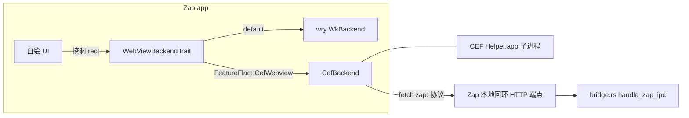

# TECH:CEF 承载 dsh webview(minimal + 单架构 + 单 renderer)

> 2026-09-20。承接 `docs/dsh-webview-engine-evaluation.md` 的决策:WKWebView 共存税 + macOS 27 下崩溃问题仍在(用户确认复现),dsh 为第三方前端,zap 侧唯一可独立根治的路径是换 Chromium 内核。本 spec 覆盖 **spike(第 0-1 阶段)+ 最小集成(第 2 阶段)**,阶段 2 以后(全面迁移 browser pane 等)不在本 spec 范围。

## 术语澄清:「关进程隔离」= 关 site isolation,不是 single_process

- **采用**:site isolation 关闭(CEF **默认即关**,无须显式操作,[CEF 论坛](https://www.magpcss.org/ceforum/viewtopic.php?f=7&t=16777))+ 单 renderer:dsh 全部页面同属一个 `127.0.0.1` origin,运行时只会存在 browser 进程 + 1 个 renderer,常驻内存 ≈ 100-120MB(评估文档 §4B 结论)。
- **明确弃用**:`single_process` 模式(browser+renderer 同进程,再省 ~40MB)。它撕裂进程隔离——WebContent 崩溃直接死整个 app,恰与当前最痛的崩溃白屏问题冲突([Chromium 进程模型](https://chromium.googlesource.com/chromium/src/+/main/docs/process_model_and_site_isolation.md))。任何 spike 阶段不开启该模式。

## Context(现状与痛点)

现链路:`app/src/dsh/runtime.rs` 拉起 `dsh --profile zap`(本地 Node HTTP 服务,随机端口+token)→ `app/src/browser/browser_web_view.rs:298` 经 **wry 0.56.1**(WKWebView)建子 webview → `DshPane` 承载。痛点与完整证据链见评估文档:

1. **内嵌共存税**:焦点抢夺/IME/U+001D/快捷键丢失/cookie 431 等 10 类 hack(`window.m` WKWebView 分支 12 处、`browser_web_view.rs:139-286` init_js ~150 行绕虫),近两月 15 个兼容类修复提交。
2. **macOS 27 下 WebContent 崩溃仍存在**(用户确认),wry 无修复路线。
3. **JSC vs V8 响应性差距**(Blink 原型实测 +28.6%),dsh 流式高频 setState 命中。
4. WKWebView 版本随用户系统浮动,不可控。

zap 侧改造面收敛在:webview 门面(约 25 pub fn,wry 类型全部集中)、ObjC 特判(换 CEF 后大半可删)、IPC 传输层(`bridge.rs` 的 `zap:` 字符串协议保留)。

**本 spec 的两个硬产物**:(1) spike 验证数据(包体/内存/签名)→ 决定是否立项;(2) 若立项,是 dsh pane 先行、WKWebView 并存的 feature-flag 形态。

## Proposed changes

### 阶段 0:CEF spike(2-3 天,目标=只验证可行性,不接产品 UI)

新建独立实验分支 + 一个最小 exec path(不进主二进制,或 `warp --cef-spike <url>` 开发通路):

1. **依赖引入**:原计划 `app/Cargo.toml` optional feature 门控;**实际执行改为独立 crate `tools/cef-spike/`(自带空 [workspace] 表,零 root workspace 改动、零新分支),依赖 `cef = "152.4.0"(crates.io,Chromium 152.0.8 分支;实现日未取 151 系,dev 主线已至 152)——版本随官方 152 分支,阶段 1 前在两处钉死语义化区间**。原生 optional-feature 门控方案保留到阶段 1 接入 app 时再回此路径。
2. **二进制供给**:CSV 把 CEF minimal 分发包(spotify CDN builds,arm64-only,不含 cefclient 测试资源)下载到 `~/.local/share/cef` 风格目录;macOS 取 `Chromium Embedded Framework.framework`。**不做 universal**。
3. **最小宿主**:借用 `scripts` 外的独立 crate(如 `tools/cef-spike/`)或 debug-only bin,建一个裸 NSWindow + CEF `(windowed 模式)` 加载本地 `dsh --profile zap` URL,验证六项(**每项都是 kill criterion,不达标即弃案**):
   - a) 包体增量实测 / b) selfsign bundle 分发启动正常 / c) **阶段 1 生死项(升级)**: Metal 共存(host 挖洞路径:CEF NSView 叠在下层，`WebViewContainerView::M:914` 同款层级;备选 OSR+`OnAcceleratedPaint` IOSurface→MTLTexture)——**阶段 0 只测裸窗启动与进程模型铺开,挖洞合并按 2026-09-21 评审 #
2 决策降级到阶段 1 第一项执行(原计划两路径其一即可的 spike 门槛未在阶段 0 强制)** / d) `zap:` IPC 通一条 / e) 内存对照(WKWebView vs CEF,同 dsh 场景) / f) 高频 UI 更新压测(Wails #4592 同款复现脚本)不崩
4. **合并判定**:a-f 全绿 → 进阶段 1;签名单项不过 → 直接弃案(无法绕过,见 Risks)。

### 阶段 1:最小集成(dsh pane 专用,feature flag)

1. **后端抽象**:`app/src/browser/` 加 `Backend` trait(把 `browser_web_view.rs` 的 ~25 pub fn 收敛为 `WebViewBackend` trait),两个实现:
   - `WkBackend`(现有 wry 代码原样搬入,默认)
   - `CefBackend`(cef-rs:进程模型=多进程+site isolation 默认关;windowed 模式挂 `WebViewContainerView` 同层,复用现有挖洞管线 scene.rs → window.rs `PlatformViewHandler`)
   - 选择经 **FeatureFlag::CefWebview**(加在 `crates/warp_core/src/features.rs`,DOGFOOD_FLAGS only;不进 PREVIEW/RELEASE)。
2. **范围**:只接 dsh pane(`DshPaneView::set_browser_view` 路径),Browser preview pane 继续走 WKWebView——`BrowserPaneView::new_dsh()` 按 flag 选 backend,外部地址栏入口不改。
3. **IPC 通道替换**:`zap:` 字符串协议原样保留,换传输层。dsh 客户端插件现用 `window.webkit.messageHandlers.ipc.postMessage`,CefBackend 下由 init_css/注入 JS 提供 shim:`window.webkit.messageHandlers.ipc = { postMessage: (s) => fetch('http://127.0.0.1:<zap_port>/webview-ipc?id=N', {method:'POST', body:s}) }`,zap 侧 `crates/http_server` 增加本地回环端点分发到 `dsh::bridge::handle_zap_ipc`。**dsh 插件零改动**(归属约束:dsh 是第三方)。
4. **内存形态**:site isolation 默认关(即"关进程隔离"的正解);dsh 单 origin → 单 renderer;**隐藏即销毁**(pane 后台/窗口关闭时销毁 CEF renderer 前台态,URL 已缓存,切回时前台化重建——`browser_web_view.rs:655 destroy` 已有同构路径,diff 是"隐藏"也走它)。
5. **损耗面收敛**:CefBackend 生效时,`window.m`/`host_view.m` 的 WKWebView 分支、init_js 中 WebKit 绕虫(Cmd+R/focus 上报/U+001D/菜单 mousedown)对该 webview 自动失效(CEF 不需要);代码暂不做删减,留到阶段 2 统一清理。
6. **ObjC 特判**:window.m 的 `NSClassFromString(@"WKWebView")` 分支对 CEF 视图不命中,自然走 `[super sendEvent:]`(CEF NSView 是标准行为)。验证浮层点击、拖拽 hover 三个已知 hack(Hoverable/propagate_drag/synthetic hover)不回归。

### 阶段 2:统一与推广(本 spec 不展开,立项后另写)

Browser pane 迁 CEF 或保留双后端;删 WebKit hack;wry 依赖降级为可选。

### End-to-end flow(与现状差异)

```
现状: dsh runtime → wry(WebViewBuilder) → WKWebView 子视图 → init_js + webkit.messageHandlers
目标: dsh runtime → WkBackend(flag off)      (不变)
      dsh runtime → CefBackend(flag on)      (CEF framework 常驻 .app)
                    → init_js shim → fetch(127.0.0.1:<zap_port>/webview-ipc)
                    → http_server 端点 → bridge::handle_zap_ipc  (协议不变)
```



## Risks and mitigations

| 风险 | 缓解 |
|------|------|
| **CEF 与 App Sandbox 不兼容**(全局 Mach port),**MAS 渠道永久不可行** | 用户已走 selfsign Developer ID(`--selfsign`),当前不受影响;本 spec 前置验收条件即"确认不进 MAS 由产品侧接受" |
| cef-rs 单社区维护、无测试套件 | spike 先行;Phase 2 前 wrap `WebViewBackend` 让回退(wry)始终一键可用 |
| CEF framework 内含硬编码版本号,升级节奏要自己背 | 版本按 `152.x` 语义化锁定(阶段 0 实装 152.4.0+152.0.8,弃 151 系:dev 主线已越过,macOS arm64 minimal 分发齐备);升级节奏写进 channel_versions 记录 |
| 签名链(new framework + helper)与现有 bundle 流程的顺序敏感 | 按 [Unreal 案例实测](https://pgaleone.eu/unrealengine/macos/2024/07/06/codesigning-notarization-issues) 的顺序先用 throwaway bundle 验证,再改 `script/macos/bundle`;验证命令沿用 AGENTS.md §5.9(codesign -dv/--verify --deep) |
| Metal 挖洞/背景层与 CEF NSView 共存性未知(透明跨界)a | spike 必须主动重放三个已知 hack 场景(dd2cdc47f/浮层/拖拽);失败则切 OSR 备选路径 |
| 内存超预期(spike 实测 >200MB 私有足迹) | kill criterion:回到 WKWebView + "隐藏即销毁"优化(该优化独立价值,可先做) |

## Testing and validation

- **Spike 验收(合并判定,2026-09-21 评审后校准)**:b/d/f + 挖洞外的 c(裸窗)通过;a/e 超限按「可入产品账」提请用户决策;c(挖洞/OSR 合并)降级为**阶段 1 第一项生死 criterion**。原始输出归档 `evidence/SPIKE-EVIDENCE.md`。
- **阶段 1**:feature `cef` 下 `cargo check` 零警告;`cargo nextest run -p warp -E 'test(bridge)'` 全绿(协议未变);手动验证:dsh pane 开启 flag 后 IPC 4 方法(switch_project/open_file_explorer/open_file/notify)与 WKWebView 行为一致;`FeatureFlag::CefWebview` 关闭 → 原路径行为逐字节不变(WkBackend 是搬运非重写)。
- **内存验证**:`footprint` 工具(或 `vmmap` 读 CEF helper 进程 RSS)对照,关闭 dsh pane 后恢复到无 CEF 基线。
