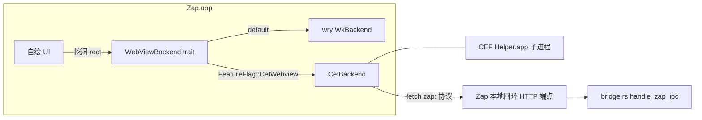

# TECH:CEF 承载 dsh webview(minimal + 单架构 + 单 renderer)

> 2026-09-20。承接 `docs/dsh-webview-engine-evaluation.md` 的决策:WKWebView 共存税 + macOS 27 下崩溃问题仍在(用户确认复现),dsh 为第三方前端,zap 侧唯一可独立根治的路径是换 Chromium 内核。本 spec 覆盖 **spike(第 0-1 阶段)+ 最小集成(第 2 阶段)**,阶段 2 以后(全面迁移 browser pane 等)不在本 spec 范围。

## 术语澄清:「关进程隔离」= 关 site isolation,不是 single_process

- **采用**:site isolation 关闭(CEF **默认即关**,无须显式操作,[CEF 论坛](https://www.magpcss.org/ceforum/viewtopic.php?f=7&t=16777))+ 单 renderer:dsh 全部页面同属一个 `127.0.0.1` origin,运行时只会存在 browser 进程 + 1 个 renderer,常驻内存 ≈ 100-120MB(评估文档 §4B 结论)。
- **明确弃用**:`single_process` 模式(browser+renderer 同进程,再省 ~40MB)。它撕裂进程隔离——WebContent 崩溃直接死整个 app,恰与当前最痛的崩溃白屏问题冲突([Chromium 进程模型](https://chromium.googlesource.com/chromium/src/+/main/docs/process_model_and_site_isolation.md))。任何 spike 阶段不开启该模式。

## Context(现状与痛点)

现链路:`app/src/dsh/runtime.rs` 拉起 `dsh --profile zap`(本地 Node HTTP 服务,随机端口+token)→ `app/src/browser/browser_web_view.rs:298` 经 **wry 0.56.1**(WKWebView)建子 webview → `DshPane` 承载。痛点与完整证据链见评估文档:

1. **内嵌共存税**:焦点抢夺/IME/U+001D/快捷键丢失/cookie 431 等 10 类 hack(`window.m` WKWebView 分支 12 处、`browser_web_view.rs:139-286` init_js ~150 行绕虫),近两月 15 个兼容类修复提交。
2. **macOS 27 下 WebContent 崩溃仍存在**(用户确认),wry 无修复路线。
3. **JSC vs V8 响应性差距**(Blink 原型实测 +28.6%),dsh 流式高频 setState 命中。
4. WKWebView 版本随用户系统浮动,不可控。

zap 侧改造面收敛在:webview 门面(约 25 pub fn,wry 类型全部集中)、ObjC 特判(换 CEF 后大半可删)、IPC 传输层(`bridge.rs` 的 `zap:` 字符串协议保留)。

**本 spec 的两个硬产物**:(1) spike 验证数据(包体/内存/签名)→ 决定是否立项;(2) 若立项,是 dsh pane 先行、WKWebView 并存的 feature-flag 形态。

## Proposed changes

### 阶段 0:CEF spike(2-3 天,目标=只验证可行性,不接产品 UI)

新建独立实验分支 + 一个最小 exec path(不进主二进制,或 `warp --cef-spike <url>` 开发通路):

1. **依赖引入**:原计划 `app/Cargo.toml` optional feature 门控;**实际执行改为独立 crate `tools/cef-spike/`(自带空 [workspace] 表,零 root workspace 改动、零新分支),依赖 `cef = "152.4.0"(crates.io,Chromium 152.0.8 分支;实现日未取 151 系,dev 主线已至 152)——版本随官方 152 分支,阶段 1 前在两处钉死语义化区间**。原生 optional-feature 门控方案保留到阶段 1 接入 app 时再回此路径。
2. **二进制供给**:CSV 把 CEF minimal 分发包(spotify CDN builds,arm64-only,不含 cefclient 测试资源)下载到 `~/.local/share/cef` 风格目录;macOS 取 `Chromium Embedded Framework.framework`。**不做 universal**。
3. **最小宿主**:借用 `scripts` 外的独立 crate(如 `tools/cef-spike/`)或 debug-only bin,建一个裸 NSWindow + CEF `(windowed 模式)` 加载本地 `dsh --profile zap` URL,验证六项(**每项都是 kill criterion,不达标即弃案**):
   - a) 包体增量实测 / b) selfsign bundle 分发启动正常 / c) **阶段 1 生死项(升级)**: Metal 共存(host 挖洞路径:CEF NSView 叠在下层，`WebViewContainerView::M:914` 同款层级;备选 OSR+`OnAcceleratedPaint` IOSurface→MTLTexture)——**阶段 0 只测裸窗启动与进程模型铺开,挖洞合并按 2026-09-21 评审 #
2 决策降级到阶段 1 第一项执行(原计划两路径其一即可的 spike 门槛未在阶段 0 强制)** / d) `zap:` IPC 通一条 / e) 内存对照(WKWebView vs CEF,同 dsh 场景) / f) 高频 UI 更新压测(Wails #4592 同款复现脚本)不崩
4. **合并判定**:a-f 全绿 → 进阶段 1;签名单项不过 → 直接弃案(无法绕过,见 Risks)。

### 阶段 1:最小集成(dsh pane 专用,feature flag)

1. **后端抽象(实现形态已调整)**:**不是** trait 重构,而是
   - `enum WebViewBackend { Wry, Cef }` + manager 内 `#[cfg(all(macos, feature = "cef_webview"))]` 的早返回分支;
   - CEF 条目的元数据另表存放(`cef_entries`,句柄在 `cef_backend` 的 UI 线程注册表),**wry 分支逐字不改** —— 这是"默认路径不变"最稳的形态,代价是两套表并存(阶段 2 统一时再考虑收敛成 trait)。
   - 选择经 **FeatureFlag::CefWebview**(`crates/warp_features/src/lib.rs` 的枚举 + `DOGFOOD_FLAGS`);**运行时还需环境开关 `ZAP_CEF_WEBVIEW`**——该路径在完成受控实跑前不默认启用。
2. **范围**:只接 dsh pane(`DshPaneView::set_browser_view` 路径),Browser preview pane 继续走 WKWebView——`BrowserPaneView::new_dsh()` 按 flag 选 backend,外部地址栏入口不改。
3. **IPC 通道替换**:`zap:` 字符串协议原样保留,换传输层。dsh 客户端插件现用 `window.webkit.messageHandlers.ipc.postMessage`,CefBackend 下由 init_css/注入 JS 提供 shim:`window.webkit.messageHandlers.ipc = { postMessage: (s) => fetch('http://127.0.0.1:<zap_port>/webview-ipc?id=N', {method:'POST', body:s}) }`,zap 侧 `crates/http_server` 增加本地回环端点分发到 `dsh::bridge::handle_zap_ipc`。**dsh 插件零改动**(归属约束:dsh 是第三方)。
4. **内存形态**:site isolation 默认关(即"关进程隔离"的正解);dsh 单 origin → 单 renderer;**隐藏即销毁**(pane 后台/窗口关闭时销毁 CEF renderer 前台态,URL 已缓存,切回时前台化重建——`browser_web_view.rs:655 destroy` 已有同构路径,diff 是"隐藏"也走它)。
5. **损耗面收敛**:CefBackend 生效时,init_js 中 WebKit 绕虫(Cmd+R/focus 上报/U+001D/菜单 mousedown)对 CEF 不再需要;`window.m`/`host_view.m` 的 WKWebView 分支则**不能**依赖"不命中即安全"(见第 6 条实测),按 #1 泛化。WebKit 专用代码暂不做删减,留到阶段 2 统一清理。
6. **ObjC 特判(实测修正,原假设被证伪)**:原写"`NSClassFromString(@"WKWebView")` 分支对 CEF 视图不命中、自然走 `[super sendEvent:]`"——**错**。实测(`evidence/phase1/RESULT.md`):不命中意味着落到 `else` 分支 `[self.contentView mouseUp:event]`,mouseUp 被投给 contentView 而不进 CEF 视图,页面只收到 mousedown、点击链断裂(分支级证据:`zap` 模式 `mouseUp branch=contentView(改投!)`;平台默认与泛化判定均为 `super`)。
   ⇒ **集成要求 #1(必须做)**:把嵌入视图判定泛化为"命中目标是否属于嵌入平台视图"(推荐:命中视图是否为 `WebViewContainerView` 的后代,或维护平台视图类注册表)。zap 侧同类类名特判共 **4 处**:`window.m:505`(LeftMouseUp)、`window.m:525`(LeftMouseDragged)、`window.m:545`(RightMouseDown,不改则 CEF 下右键菜单失效)、`window.m:607-608`(`performKeyEquivalent`,定义在 :593,负责 Cmd+C/V/X/A)。
   另:`host_view.m:281` 是 tracking-area 注释行,**该文件内没有类名判定**;"CEF 下 hover 是否失效"为「未验证推测」,留待集成后实测。
   ⇒ **集成要求 #2(必须做)**:CEF 子视图尺寸跟随**父视图增量**而非洞 rect(实测窗口 +240/+160 后视图 600×400 → 840×560,洞仍 600×400,且未通知 Chromium 视口)。CefBackend 必须实现与 `BrowserWebViewManager::set_bounds`(browser_web_view.rs:634)等价的每帧布局 + `was_resized()`,并且**复刻 wry 的坐标翻转**——zap 逻辑 rect 是左上原点,wry 在 `window_position`(wry-0.56.1 wkwebview/mod.rs:1446)做 `parentHeight - y - h`,CEF `set_as_child` 取 AppKit frame 坐标,不翻转会垂直错位(未实测,代码可溯)。
7. **CEF 的 macOS 宿主契约(集成要求 #3/#4,集成前必读)**:CEF 要求进程的 `NSApplication` 实现
   `CefAppProtocol`(`isHandlingSendEvent` / `setHandlingSendEvent:`),并在 `sendEvent:` 前后夹住
   handling 标志;cef-rs 的示例是靠**子类化 NSApplication**(`SimpleApplication`)在启动时创建的。
   zap/warpui 目前既没有 NSApplication 子类也没有方法交换(全仓 grep 无 `object_setClass`/`class_addMethod`),
   且 NSApp 常被更早创建 ⇒ 推荐用**运行时 category + method swizzle**在 NSApplication 上补齐协议
   (只在 CEF 后端启用时激活),而不是子类化;`terminate:` 也需接 CEF 的 orderly shutdown。
   (#4 事件循环)CEF 必须有自己的消息泵:zap 已有 winit/warpui 事件循环,故应设
   `external_message_pump = 1` 并在主线程**稳定周期**(空闲也要)调用 `cef::do_message_loop_work()`,
   不能依赖"有帧才跑"的 `on_frame_drawn`。
   证据:`cef-rs/cef/src/application_mac.rs`(协议定义)、`cef-rs/examples/cefsimple/src/mac/mod.rs:101-175`(子类契约)。

### 阶段 1 集成进度(截至本次)

| 项 | 状态 | 说明 |
|----|------|------|
| 回环 IPC shim(服务端 + 注入脚本) | ✅ 已落 | `app/src/dsh/loopback_ipc.rs`(token 门控 + 64KiB 体限,仅 flag 开启时注册);5 个单测通过 |
| `FeatureFlag::CefWebview` | ✅ 已落 | `crates/warp_features/src/lib.rs`,仅 DOGFOOD_FLAGS |
| 事件判定泛化(集成要求 #1) | ✅ 已落 | `window.m`:4 处类名特判 → `warp_is_embedded_platform_view`(按"是否 WebViewContainerView 后代");warpui 的 `HasWindowHandle` 返回容器(window.rs:1110-1119),故 WKWebView 行为不变 |
| CEF 依赖与后端骨架 | ✅ 可编译可链接 | `cef_webview` feature + `app/src/browser/cef_backend.rs`(加载顺序、初始化和消息泵、`create_child_browser`);`CEF_PATH=~/.local/share/cef cargo check -p warp --features cef_webview` 通过,默认构建零影响。**踩坑已修**:`execute_process` 必须在加载 CEF 库 + `api_hash` 之后调用,否则 SIGSEGV(单测先抓到,已按 spike 的 proven 顺序修正) |
| NSApp 契约(集成要求 #3) | ✅ 已落 | `app/src/platform/mac/objc/cef_support.m`(category 补 `isHandlingSendEvent`/`setHandlingSendEvent:` + 交换 `sendEvent:` 夹标志),仅 `cef_webview` feature 下编译;运行时由 `cef_backend::install_app_protocol_support()` 在创建浏览器前安装 |
| 启动接线 + 消息泵(集成要求 #4) | ✅ 已落(待受控环境实跑) | `warp::run()` 内:NSApp 就绪后安装协议桥 → `initialize_runtime()` → `start_pump()`(主线程 60Hz `NSTimer`→`do_message_loop_work`)。**分流位置修正**:`maybe_run_as_cef_subprocess()` 必须在 bin 的 `ChannelState::new` **之前**(否则 helper 的带后缀 bundle id 会让 AppId 解析 panic,实测 5 个 helper 全 panic 在 channel/state.rs:277) |
| bundle 流水线(CEF framework + 5 helper) | 🚧 脚本完成并端到端验证,尚未接进 `bundle` | 新增 `script/macos/cef_embed`(framework + 5 个 helper.app + 分层签名)。**两条实测硬要求**:(1) helper.app 内可执行文件必须**重命名为 `<主可执行名> <Helper>`**且 `CFBundleExecutable` 与之一致 —— 保留原文件名时 GPU/Renderer 启动失败(`gpu_process_host ... error_code=1003`),对齐后从零构建验证 `0 failed / 0 FATAL` 且页面正常加载(probe.loaded);(2) helper 进程加载库必须 `helper=true`(framework 在**外层** app 的 Contents/Frameworks 下),已落在 `cef_backend::load_library`。**接线顺序**:先完成启动接线(主二进制分流 `--type=`)再给 `bundle` 加 `--cef` —— 否则 helper 会以完整 Zap 启动(实例风暴风险) |
| 独立 CEF helper 二进制 | ✅ 已落并实跑验证 | 新增 workspace 外 crate `tools/cef-helper`(0.43MB,只依赖 cef)。**起因**:主二进制当 helper 会让 5 个 helper.app 各含一份 app 可执行文件 —— debug 实测包体 **3833MB**;换成专用 helper 后同配置 **905MB**(589 app + 317 framework + 5×0.43)。已用 spike app 验证 CEF 真实拉起该 helper:`0 次 GPU 启动失败` + 页面正常加载 |
| `script/macos/bundle --cef` 接线 | ✅ 已落 | `--cef` 追加 `cef_webview` feature,并在 Step 1.5 构建 `tools/cef-helper` + 调 `script/macos/cef_embed`(framework + 5 helper + 分层签名)。语法检查通过,命令按逐字演练验证(见 `evidence/phase1/BUNDLE-WIRING.md`);**完整 release-lto 正式打包未跑** |
| 门面抽象 + CefBackend 接 dsh pane | ✅ 已落(待受控实跑) | manager 侧用 `WebViewBackend { Wry, Cef }`;CEF 条目**另表存放**(`cef_entries`,句柄在 `cef_backend` 的 UI 线程注册表),wry 路径逐字未改;`BrowserPaneView::new_dsh` 在 CEF 就绪时选 CEF,否则自动回退 wry。CEF 侧实现:navigate/reload/evaluate/focus/set_bounds(含坐标翻转+`was_resized`)/set_visible/destroy,注入回环 shim;`script/macos/bundle --cef` 接线仍待做 |
| 注册表纯逻辑单测 | ✅ 3/3 | `flip_rect_to_appkit`(坐标翻转公式,集成要求 #2 的核心)、`is_enabled()` 初始化前为 false、`pump()` 未初始化 no-op;`cargo nextest -p warp --features cef_webview -E 'test(cef_backend)'` 全绿。**修复**:复核时发现 `set_bounds` 在"已挂起(无浏览器)"时不会更新缓存几何,重建会用旧 rect —— 改为无条件缓存 `pending_rect` 并在重建时按最新逻辑坐标重算 |
| 内核开关 + 冻结设置(2026-09-21) | ✅ 已落并实跑通过 | 功能页新增「使用 Chromium 内核」(上)与「隐藏的内嵌网页冻结超时」(下),均仅 macOS;`cef_backend::ensure_initialized()` 支持按需初始化(开关即时生效、无需重启) |
| 隐藏行为(2026-09-21 策略变更) | ✅ 已落 | **取消"隐藏即销毁"**(用户要求):隐藏只把原生视图 `setHidden:` + `was_hidden(1)`,renderer 保活、切回不重载。起因:实跑发现"隐藏时视图不消失"——`do_close` 返回 1(由客户端接管关闭)后没人完成关闭,视图残留,重建时还叠加第二层(用户报告"切到别的 tab 底下还是 webview")。**新增"隐藏超时冻结"**:隐藏超过阈值后发 CDP `Page.setWebLifecycleState=frozen`(保 DOM/会话,只停页面 JS 与渲染;dsh Node 服务端与 agent 不受影响),切回发 `active` 解冻。阈值来自设置 `general.webview.freeze_after_secs`(默认 **300s**,`0`=关闭),dev 可用 `ZAP_CEF_FREEZE_AFTER_SECS` 覆盖 |

### 实跑验证(2026-09-21,已完成)✅

`zap 本体 + CEF` 的 GUI 实跑通过:**dsh pane 正常渲染,用户实机确认不再停在"启动中"**。
日志证据(`[browser] create webview … backend=Cef` → `[cef] webview 1 browser created` →
`[cef] webview 1 loaded (shim 注入)`)、三个实跑才暴露的真问题(加载事件未回传、CEF 被子进程重复初始化
+ 缓存路径配错导致主进程被 SIGKILL、"又开启一个实例"的成因)与修复见
`evidence/phase1/RUNTIME-VERIFICATION.md`。

### 无 GUI 静态取证(2026-09-21)

见 `evidence/phase1/STATIC-CHECKS.md`。要点:**Chromium 的 `RenderWidgetHostViewCocoa`
实现了 `paste:`/`cut:`/`selectAll:`/`copy:`(dlopen + ObjC runtime 实测),而外层
`CefBrowserHostView` 没有** ⇒ Cmd+V/X/A 在 CEF 上可用,新增的 selector 守卫是必要兜底。

### 阶段 1 评审处理(2026-09-21,独立评审 With fixes)

| 严重度 | 问题 | 处理 |
|--------|------|------|
| Critical | `drain_pending_platform_views` 的"未上报即隐藏"只遍历 wry 表 ⇒ CEF 条目从不隐藏:切 tab 时 renderer 常驻(违背隐藏即销毁)+ 残留视图可能透出 | ✅ 隐藏 pass 增加 CEF 分支(与 `cleanup_window` 同款) |
| Critical | shim 每个 browser 只注入一次 ⇒ 第二次文档加载(reload/重定向/`location.replace`)后 `webkit.messageHandlers.ipc` 不存在,`zap.*` 静默失效 | ✅ 改为**每次**主 frame `on_load_end` 注入(shim 自带幂等守卫,与 wry 的 `init_js` 每次导航重放等价) |
| Important | 未实现 `do_close`:CEF windowed 默认会把关闭转发给**顶层父窗口**(即 Zap 主窗),隐藏 dsh pane 可能误关主窗 | ✅ `do_close` 显式返回 1(由我们接管),并在 `on_before_close` 防御性 `removeFromSuperview`(标注:CEF 实现层行为仍属**未实跑验证**) |
| Important | Cmd+V/X/A 缺 `respondsToSelector` 守卫 ⇒ CEF 宿主视图若不实现这些 selector 会 unrecognized selector 崩溃 | ✅ 三个 selector 均加守卫,缺失则回退 `[super performKeyEquivalent:]` |
| Important | 回环端点只按运行时 flag 注册,feature-off 构建里模块仍编译、`dispatch2` 成直接依赖 | ✅ 注册点加 `#[cfg(feature = "cef_webview")]` 双重门控 |
| Important | `cef_embed` 的 framework 用非 deep 签名 + 非 deep 自校验 ⇒ 假绿(内嵌 dylib 仍是 adhoc) | ✅ framework 改 `--deep` 签名、自校验改 `--verify --deep --strict`;`bundle --cef` 透传签名身份(`CEF_EMBED_SIGN_IDENTITY`);CEF 前置检查提前到构建前 + 交叉架构守卫 |
| Minor | `create_child_browser` 死代码;TECH §1 仍写 trait;shim token 走 query 可能被 TraceLayer 记账;跨源 CORS 噪音;`can_go_back/forward` 冗余早返回;协议桥在初始化失败时仍永久 swizzle | ✅ 死代码删除;§1 按实际形态改写;token 改走**请求体信封**(请求头在 no-cors 下会被静默丢弃,见 CODE-REVIEW B1);冗余分支删除;改为**初始化成功后**才装协议桥 |
| 评审建议 | feature 构建即默认启用 CEF 路径(尚未实跑) | ✅ 追加运行时环境开关 `ZAP_CEF_WEBVIEW`(feature + env + flag 三重门控);`cef_smoke` 已同步 |

### 阶段 1 第一项(生死项)结果:有条件通过 ⚠️

探针 `tools/cef-spike`(bin `hole-probe`,自包含复现脚本 `probes/run_hole_probe.sh`),证据 `evidence/phase1/RESULT.md`:
落点/层级/命中/页面运行/输入可达(key window 下完整点击链 = 黄金运行 `resize_server.log`)均通过;
**尺寸跟随不成立**、**像素级渲染证据受环境(屏幕锁定)阻塞**——两者都不改变结论方向,但按要素逐条计入
(见 RESULT.md §1 表)。附两条集成要求:#1 事件判定泛化(4 处)、#2 尺寸每帧驱动 + 坐标翻转。
方法论:页面级事件与截图都要求屏幕可用;屏幕锁定时窗口不成 key、Chromium 丢弃合成事件,
此时以 `mouseUp branch=` 分支日志为唯一有效证据(探针会打印 isKeyWindow/appActive 供判读)。
补跑(屏幕可用时):`probes/run_hole_probe.sh plain A_plain` 等,像素采样自动完成。


### 阶段 2:统一与推广(本 spec 不展开,立项后另写)

Browser pane 迁 CEF 或保留双后端;删 WebKit hack;wry 依赖降级为可选。

### End-to-end flow(与现状差异)

```
现状: dsh runtime → wry(WebViewBuilder) → WKWebView 子视图 → init_js + webkit.messageHandlers
目标: dsh runtime → WkBackend(flag off)      (不变)
      dsh runtime → CefBackend(flag on)      (CEF framework 常驻 .app)
                    → init_js shim → fetch(127.0.0.1:<zap_port>/webview-ipc)
                    → http_server 端点 → bridge::handle_zap_ipc  (协议不变)
```



## Risks and mitigations

| 风险 | 缓解 |
|------|------|
| **CEF 与 App Sandbox 不兼容**(全局 Mach port),**MAS 渠道永久不可行** | 用户已走 selfsign Developer ID(`--selfsign`),当前不受影响;本 spec 前置验收条件即"确认不进 MAS 由产品侧接受" |
| cef-rs 单社区维护、无测试套件 | spike 先行;Phase 2 前 wrap `WebViewBackend` 让回退(wry)始终一键可用 |
| CEF framework 内含硬编码版本号,升级节奏要自己背 | 版本按 `152.x` 语义化锁定(阶段 0 实装 152.4.0+152.0.8,弃 151 系:dev 主线已越过,macOS arm64 minimal 分发齐备);升级节奏写进 channel_versions 记录 |
| 签名链(new framework + helper)与现有 bundle 流程的顺序敏感 | 按 [Unreal 案例实测](https://pgaleone.eu/unrealengine/macos/2024/07/06/codesigning-notarization-issues) 的顺序先用 throwaway bundle 验证,再改 `script/macos/bundle`;验证命令沿用 AGENTS.md §5.9(codesign -dv/--verify --deep) |
| Metal 挖洞/背景层与 CEF NSView 共存性未知(透明跨界)a | spike 必须主动重放三个已知 hack 场景(dd2cdc47f/浮层/拖拽);失败则切 OSR 备选路径 |
| 内存超预期(spike 实测 >200MB 私有足迹) | kill criterion:回到 WKWebView + "隐藏即销毁"优化(该优化独立价值,可先做) |

## Testing and validation

- **Spike 验收(合并判定,2026-09-21 评审后校准)**:b/d/f + 挖洞外的 c(裸窗)通过;a/e 超限按「可入产品账」提请用户决策;c(挖洞/OSR 合并)降级为**阶段 1 第一项生死 criterion**。原始输出归档 `evidence/SPIKE-EVIDENCE.md`。
- **阶段 1**:feature `cef` 下 `cargo check` 零警告;`cargo nextest run -p warp -E 'test(bridge)'` 全绿(协议未变);手动验证:dsh pane 开启 flag 后 IPC 4 方法(switch_project/open_file_explorer/open_file/notify)与 WKWebView 行为一致;`FeatureFlag::CefWebview` 关闭 → 原路径行为逐字节不变(WkBackend 是搬运非重写)。
- **内存验证**:`footprint` 工具(或 `vmmap` 读 CEF helper 进程 RSS)对照,关闭 dsh pane 后恢复到无 CEF 基线。

---

## 渲染模式与开关(2026-09-22 定稿)

CEF 后端支持两种渲染模式,**默认 windowed**:

| 模式 | 实现 | 适用 |
|------|------|------|
| `Windowed`(默认) | CEF 自建原生子视图挂进 warpui 的 `WebViewContainerView` | 与阶段 1 完全一致;半透明窗口下 CEF 区域**不透光**(见 `TRANSPARENCY.md`) |
| `Osr`(windowless) | 宿主自建 `WarpCefOsrView`:`on_accelerated_paint` 的 IOSurface 直接贴 `CALayer.contents`(零拷贝),CPU 位图兜底 | 真透明所需;输入/IME/弹层/菜单全部由宿主转接 |

**开关(二者的优先级)**:

1. `general.webview.use_osr_rendering`(设置项,设置页「使用无窗口(OSR)渲染」,默认 false)
2. 环境变量 `ZAP_CEF_OSR`:**非空即覆盖**设置项(dev 排查/灰度用;`=0` 或 `=yes` 这类非真值
   也算显式覆盖 ⇒ 回落 windowed)

**生效时机**:`windowless_rendering_enabled` 是 `CefSettings` 上的**进程级**开关 ⇒ 一旦
`CefInitialize` 就不能改,设置改动**下次启动生效**。为避免"设置被静默忽略",实现上有两条保证:

- 启动期的 eager 初始化被**推迟到首帧**(设置已在帧回调最前面推入),懒初始化则在
  `BrowserPaneView::new_dsh` 里 `ensure_initialized()` **之前**补推一次;
- `render_mode()` 打印**永久观测点**:`[cef] render mode = … (env …, setting …)`,
  日志里能直接确认"到底听了谁"。

**OSR 实现期固化的硬约束**(违反会导致静默失效或崩溃)见 `OSR-PLAN.md` 的 T5/T7/T8 小节与
`TRANSPARENCY.md` §7.1;其中最容易踩的是两条:**IME `replacement_range` 必须显式 InvalidRange**、
**不得在持有 `WEBVIEWS` 借用时调用外部(ObjC/CEF)**。
