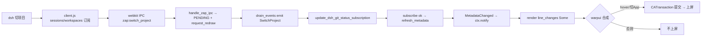

# dsh badge / 面板不刷新 — 全量已知信息（截至 2026-08-20 复核修订）

> 关联批准计划：`local://PLAN.md`（dsh badge 跨项目跟随刷新，4 步：Workspace.dsh_git_status 字段 → BridgeServer 订阅 → handle_dsh_switch_project/update_dsh_git_status_subscription → render_right_panel_button dsh 优先 fallback）。`crates/warpui/**` 合成问题不在本计划，计划只保证数据源正确绑定。
> 本次修订：核对源码，修正 3 处过时表述、补充 2 处遗漏（见 §8 末尾修订记录）。

## 1. 背景与目标

- 现象：终端切项目 badge (`+N/-N`) 100% 跟随；dsh 内部切项目数据链路 `MetadataChanged → ctx.notify() → renderer.render → line_changes=Some(...)` 通，但**画面不上屏**，hover header 或切应用才上屏。
- 目标：Workspace 自有 `GitRepoStatusModel` handle，badge 直接从它读 `metadata.stats_against_head`，不依赖 `active_session_view`（terminal）。
- 基线渲染：`WorkspaceView::render_right_panel_button` (view.rs:16148) 原 `active_tab_pane_group().active_session_view(ctx).and_then(|tv| tv.as_ref(ctx).current_diff_line_changes(ctx))`，dsh pane group 无 terminal → `None` → 无 badge。
- 约束：不需要 `#[cfg(feature="local_fs")]` 全量开放；WebSocket 删干净；dsh 切项目通知 Zap 即可；不用 `deepseek` 命名改回 `dsh`（`is_dsh_pane` 匹配 `IPaneType::DeepSeek`）；`crates/warpui/**` 不动；用户要求提案后 STOP 等授权。

## 2. 总体架构与关键文件

```
dsh 浏览器端 cordis 上下文 (sessions/workspaces)
  → zap-bridge-client.js (window.__ModuleLoader__.load) 订阅 list → reportCurrentPath
  → webkit.messageHandlers.ipc.postMessage('zap:'+ payload(method\nid\nparams_json))
  → app/src/browser/browser_web_view.rs ipc_handler `zap:` 路由 → dsh::bridge::handle_zap_ipc
    ├─ 校验 canonicalize + is_dir → set_workspace_dir → push_event(SwitchProject)
    └─ 立即 Window::request_redraw_all_windows()（macOS，空闲期强制触发下一帧）
  → PENDING_EVENTS (LazyLock<Mutex<Vec<BridgeEvent>>>) → lib.rs on_frame_drawn 每帧 drain_events → ModelContext::emit(BridgeEvent::SwitchProject{path})
    └─ fallback: has_pending_events() 残余 → 遍历 window.request_redraw()
  → app/src/workspace/view.rs Workspace::new 订阅 DshRuntime（3 个独立订阅，见下）→ handle_dsh_switch_project(path) → set_workspace_dir(path) + update_dsh_git_status_subscription(ctx)
  → GitStatusUpdateModel::subscribe(&dir) → 校验 canonicalize(repo_path)==dir → handle 存 dsh_git_status → subscribe_to_model(MetadataChanged→ctx.notify()) → ctx.notify()
  → render_right_panel_button 读 dsh_git_status.metadata().from_diff_stats → line_changes → Flex 行渲染 +N/-N
  → warpui 合成 → CAMetalLayer present → 上屏（hover 触发 CATransaction；IPC 已加主动 request_redraw 仍不上屏则属合成层问题）
```

关键符号：
- `app/src/workspace/view.rs:1018 dsh_git_status: Option<ModelHandle<GitRepoStatusModel>>`，`3092 None`，`has_dsh_pane:19032`，`handle_dsh_switch_project:19039`，`update_dsh_git_status_subscription:19050`，`render_right_panel_button:16148`（dsh_line_changes 在 show_diff_stats 外算，`dsh.or(tv).filter>0`），`open_dsh_pane:18927` 闭包后补 `update_dsh_git_status_subscription`
- `app/src/dsh/bridge.rs` 重写 IPC-only 138 行：`BridgeEvent{Notify,SwitchProject{path},Ready,Updating,Restarted,Failed}`，`PENDING_EVENTS`，`push_event/drain_events/handle_zap_ipc`（`method\nid\nparams_json`，`zap.switch_project`/`zap.notify`）
- `app/src/dsh/runtime.rs:599 install_client_plugin(dsh_home)` 写 `@zap/zap-bridge-client/{index.js,client.js,package.json}` + `profiles/web/cordis.patch.yml`（`- insert: id: zap-bridge-client name: '@zap/zap-bridge-client'` 包名，`require.resolve` 关键；注意 `package.json` 内 `name` 为 `zap-bridge-client` 无 scope，scope 体现在目录 `@zap/`）
- `app/assets/bundled/dsh/zap-bridge-client.js` `window.__ModuleLoader__.load({id:"@zap/zap-bridge-client", factory:(require)=>{... inject:["sessions","workspaces"] ... zapRpc('zap.switch_project') }})`，`zap-bridge-client-package.json` `dsh.client{platform:web,inject:["sessions","workspaces"],immediately:true}` + `exports{".":"./index.js","./client":"./client.js"}`
- `app/src/pane_group/pane/mod.rs:457 is_dsh_pane()`（`IPaneType::DeepSeek`），`app/src/browser/browser_web_view.rs:32 DSH_WEBVIEW_IDS` 校验 + 253 `zap:` 路由 + 258 `request_redraw_all_windows`，`app/src/lib.rs:1510` 每帧 `drain_events` + 1517 fallback，`app/src/workspace/view/right_panel.rs:342 dsh_repo_path` / `611 set_dsh_repo` / `658 open_code_review(is_dsh)` / `837 render_panel_content` 放行 `dsh_repo_path`
- `Workspace::new` 订阅（view.rs:2601-2695，三处独立 `subscribe_to_model(DshRuntime::handle)`）：① `Ready/Restarted/Updating/Failed` 导航/toast ② `Notify → NotificationsModel::add_dsh_notification` ③ `SwitchProject → handle_dsh_switch_project`

## 3. 已完成（Done）与当前状态

- [x] `Workspace::dsh_git_status` 字段 + 字面量 `None`（曾误删 8 行 `use tab_configs::{SidecarItemKind,...}` 致 37 error，已恢复 `cargo check 0 error, 29 warnings`）
- [x] `Workspace::new` 末尾 3 个 `DshRuntime` 订阅：Ready/Restarted 导航、Notify 入箱、SwitchProject → `has_dsh_pane` guard → `handle_dsh_switch_project`
- [x] `handle_dsh_switch_project` + `update_dsh_git_status_subscription`（repo_path 校验，`subscribe failed: No watched repository` → None，`repo path mismatch → None`，末尾 `ctx.notify()`；订阅后 `handle.update(|m,c| m.refresh_metadata(c))` 解决缓存命中不刷新）
- [x] `render_right_panel_button` dsh 优先：`dsh_line_changes` 外算 `from_diff_stats(&stats_against_head)`，`dsh.or(tv).filter>0`
- [x] `open_dsh_pane` 闭包后补订阅解决首次无 SwitchProject
- [x] `should_enable_file_tree... || is_dsh_pane()` + `is_dsh_pane`
- [x] `bridge.rs` 重写 IPC-only，`runtime.rs` 删 WebSocket 改 `install_client_plugin`，`browser_web_view.rs` `zap:` 路由 + IPC 内 `request_redraw_all_windows` + `lib.rs` fallback `has_pending_events → request_redraw`
- [x] `cargo build -p warp --bin zap-oss` 通过，新 debug 实例 PID 98473/21649，`~/Library/Logs/zap.log` `subscribe ok → MetadataChanged ×4`，`__DSH_BOOT__` 含 entry、`/plugins/.../client.js` 200、`IPC SwitchProject path=/Users/zhong/project/zap` 到达 Rust，`Set available_branches with 4 branches` 无 `NoRepoFound`
- [x] RightPanel dsh 支持骨架：`dsh_repo_path` 字段 + `set_dsh_repo`（旧→关，新→`get_or_create_diff_state_model → open_code_review(None,true)`），`create_code_review_view(is_dsh, Option<WeakViewHandle>)` 跳过 `has_active_repos`，`render_panel_content:837` 放行 `dsh_repo_path`（`available.contains || dsh==dsh_repo`），`Workspace.update...` 各分支同步 `right_pane.set_dsh_repo`

当前验证实例：`zap-e2e` PID 21649，`~/Library/Logs/zap.log` 最新 16:16:26 `subscribe ok handle_id=EntityId(3192)` + `MetadataChanged ×4` + `ToggleRightPanel` 两次。

遗留未修（指导不刷新报障）：
- badge 非 git 仍数：`16192 .or(tv_changes)` 使 None 退 terminal
- 面板 `Cannot detect`：`right_panel.rs:630 get_or_create_diff_state_model None` 直接 return 未选（`selected_repo_path` 空）

## 4. 全部尝试与结论

### 4.1 数据源绑定类

| 尝试 | 结果 | 结论 |
|---|---|---|
| Workspace 字段 + DshRuntime 订阅 + update_dsh_git_status_subscription + badge or fallback | 通，终端 100% | 方案成立 |
| open_dsh_pane 补订阅 | 通 | 首次有订阅 |
| canonicalize 校验防父 repo 残留 | 通，zap ok / dsh-plugins 非 git 失败符合预期（用户澄清 dsh-plugins 非 git） | 校验有效 |
| badge `.or(tv_changes)` | **错**，非 git 仍显另一仓库 | 应 dsh 活跃独占 |
| 缓存 handle 不 refresh | **错**，切回同一 git 旧数 | 已加强制 refresh |

### 4.2 通信链路类

| 尝试 | 结果 | 结论 |
|---|---|---|
| BridgeServer WebSocket + BRIDGE_INFO/token + zap-bridge.ts host | 端口随机不稳 | 用户要求删干净 |
| 重写 bridge.rs IPC-only + browser_web_view `zap:` + runtime install_client_plugin | 通，`__DSH_BOOT__`/`/plugins`/`IPC SwitchProject` 均到 Rust | 干净链路成立 |
| evaluate_script_on 在 pane.rs UrlChanged 同步注入 __ModuleLoader__ | **闪退**（wry borrow + 未就绪） | 回滚，改静写 cordis |
| 诊断 patch `name:'.../index.js'` 文件路径 vs 包名 | 文件路径 `require.resolve FAIL` 不入表；包名 `@zap/zap-bridge-client` OK（`profiles/web` 向上查 `~/.dsh/node_modules`） | 根因定位 |
| client.js `id:"zap-bridge-client"` 与 graph id 不匹配 | `bundle loaded without registering` | 改 `id:"@zap/zap-bridge-client"` 后通 |

### 4.3 渲染强制刷新类（全部闪退/无效，已回滚，判定范围外）

| 尝试 | 结果 |
|---|---|
| postEvent 合成事件 | 无 |
| JS 动画 / 全量 view 失效 / host_view displayLayer / setNeedsDisplay:YES / dispatch_async / browser 动画 / focus 递归 / update_windows_called | 无 |
| `[self displayIfNeeded]` 调 WarpWindow 默认 displayIfNeeded → NSWindow drawRect 空 + DuringViewResize + Metal | **闪退**，`python /tmp/revert_inject.py` 收敛 |
| 结论 | 全闪退，用户确认 `crates/warpui/**` 不在计划，数据正确为前提，合成另案；现 IPC 已加 `request_redraw_all_windows` 仍不上屏则确属合成层 |

### 4.4 更早记忆（手工上下文）

- side-by-side diff：`diff_layout.rs` 纯内存，不引 schemars
- 通知：`specs/dsh-plugin-integration/TECH-notify.md` 未提交，`BridgeEvent::Notify` + `ZAP_CAPABILITIES notify` + `NotificationSourceAgent::Dsh` + `NotificationOrigin::DshSession`
- `git checkout -- .` 丢 working tree（无 stash），含 dsh badge 整段，本次 177 行 PLAN 重建
- 合并教训：`specs/upstream-merge-lessons.md` 边界 hash，非 `HEAD..upstream/master` 1795
- Watcher 验证缺口：从未 `touch` 文件看 badge 上屏
- `zap-bridge.ts` 旧 56/-187 行等 24 文件 1026/-842 行批改在 topic 外

## 5. 不刷新的已知信息汇总

### 5.1 共识

- 数据 `MetadataChanged→ctx.notify` 通，数对但不上屏，hover/切应用才上，真链路
- 本计划不管 `crates/warpui/**`

### 5.2 当前可修、非合成（两 bug 叠加被报作不刷新）

1. **badge 退化**：`view.rs:16192 dsh_line_changes.or(tv_changes)` → dsh None 退 terminal 数
2. **面板未选**：`right_panel.rs:630 set_dsh_repo` 的 `get_or_create_diff_state_model None` 直接 return，未 `set_selected_repo`；`active_pane_group None` 早于 SwitchProject 也 return → `render_panel_content:837` 即使放行仍空 → `Cannot detect`

### 5.3 切换不刷新

- 前两 bug 叠加 + 合成不上屏（IPC 已加主动重绘仍不上的部分）

## 6. 根因推测（待定，非缺回顾）



`ctx.notify()` 仅 dirty Workspace，已触发 render，但 `CAMetalLayer presentDrawable` 未提交；hover mouse-move 触发 `App::updateWindows` → `CATransaction` 才提交。探针方向：`warpui_core App::notify_windows / displayLink / metal present` 定位 `ctx.notify` 到 `present` 缺口，选安全触发（`callback_dispatcher` 空更新 / `NSApp updateWindows` / `metalLayer setNeedsDisplay`），不直接 `WarpWindow displayIfNeeded`。现 IPC 路径已加 `request_redraw_all_windows`，若仍不自动上屏则确认缺口在合成层。

## 7. 验证证据

- `~/Library/Logs/zap.log` 15:49-16:16：`[dsh] installed zap-bridge-client`，`subscribe ok handle_id=EntityId(3192/3220)`，`MetadataChanged event received ×4`，`IPC SwitchProject path=/Users/zhong/project/zap`，`Set available_branches with 4 branches` 无 `NoRepoFound`，`ToggleRightPanel` 两次
- `__DSH_BOOT__`：`@zap/zap-bridge-client | inject:['sessions','workspaces'] | imm:true`，`GET /plugins/.../client.js` 200，`__ModuleLoader__.load id` 匹配
- `cargo check -p warp` 0 error（29 warnings）

## 8. 风险与下一步

风险：合成触发误触 Metal 闪退；`get_or_create_diff_state_model` 对非当前 terminal 项目的 git 可能仍 None → 面板仍 NoRepoFound（先保 zap）；CodeReviewView 无 terminal 时 review 发送/GitSessionState 降级可接受。

下一步（最小 diff，3 文件）：
1. `view.rs:16186` badge 独占分支：`is_dsh_active = active_pane_id.is_dsh_pane()`，dsh 时只读 `dsh_line_changes.filter>0`，不 `or`
2. `right_panel.rs:630` set_dsh_repo 兜底：非 git `close+None`，git 但 model None 时 `warn+set_selected+log`
3. `warpui_core` 只读探针：读 `App::notify_windows` 路径，定 `present` 缺口

执行前需授权。

---
### 修订记录（2026-08-20 复核）

- §2 架构图：补 `handle_zap_ipc → request_redraw_all_windows` 与 `lib.rs has_pending_events fallback`，原“纯 on_frame_drawn 每帧 drain”已过时
- §2 关键符号：`Workspace::new` 订阅由“1 个 SwitchProject”更正为“3 个独立订阅（Ready/Restarted/Notify/SwitchProject 分流）”；`package.json name` 更正为 `zap-bridge-client`（无 scope，scope 在目录 `@zap/`），`cordis.patch.yml name` 仍为 `@zap/zap-bridge-client`
- §2/§3 行号：`render_right_panel_button` 等标注随重构漂移，保留量级、更新至 16148/18927/19032/19039，现值以源码为准
- §4.3/§6：补充 IPC 已加主动重绘仍不上屏的判定，明确剩余不上屏属 `crates/warpui/**` 合成层
